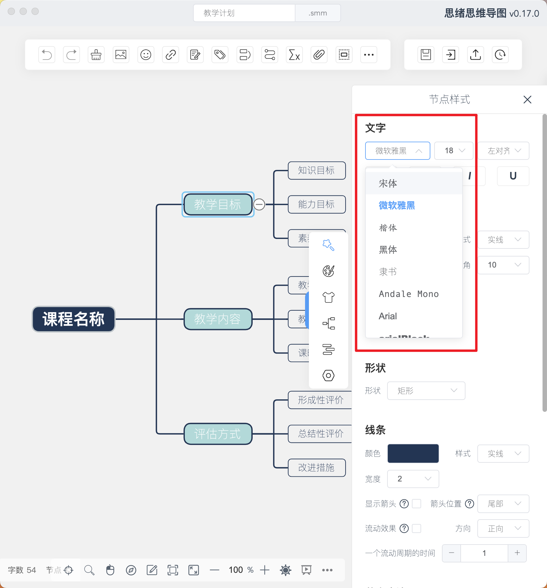
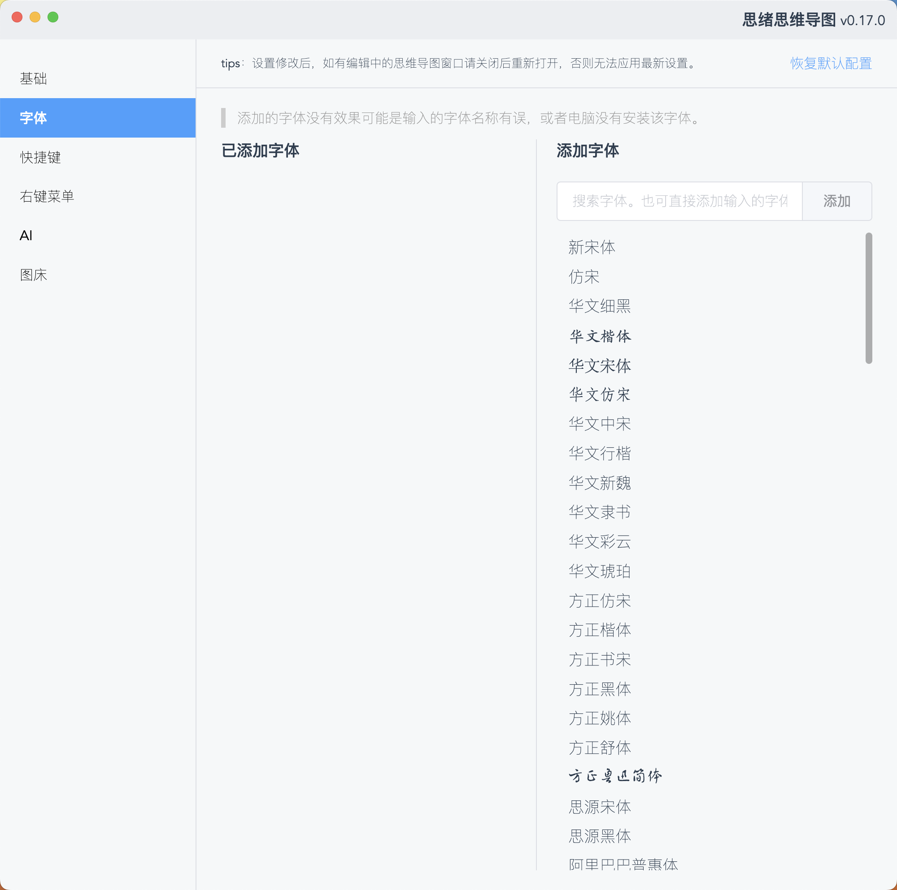
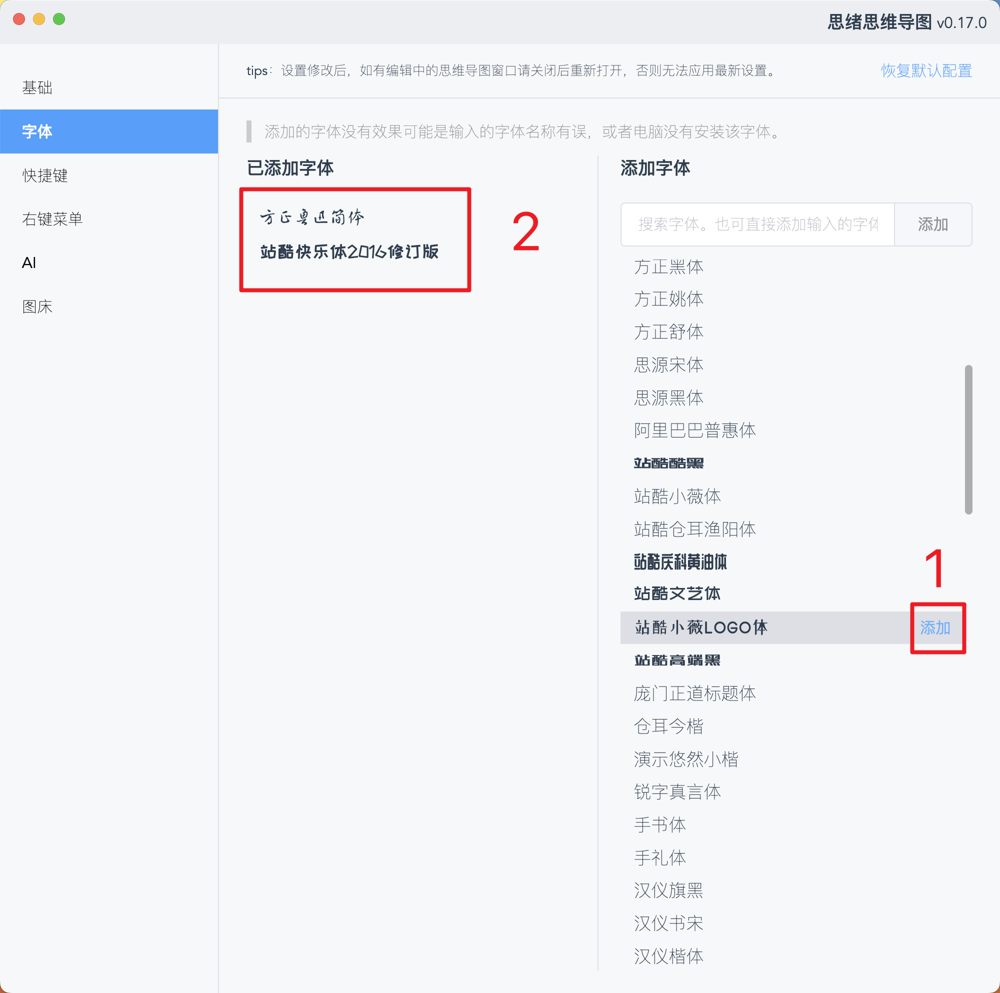
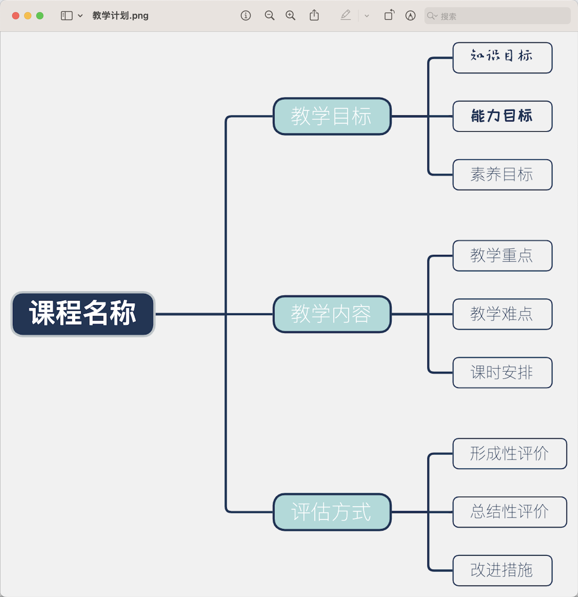
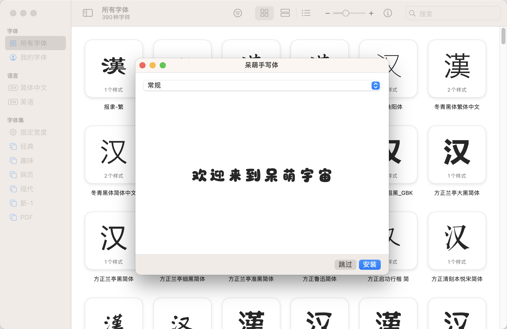
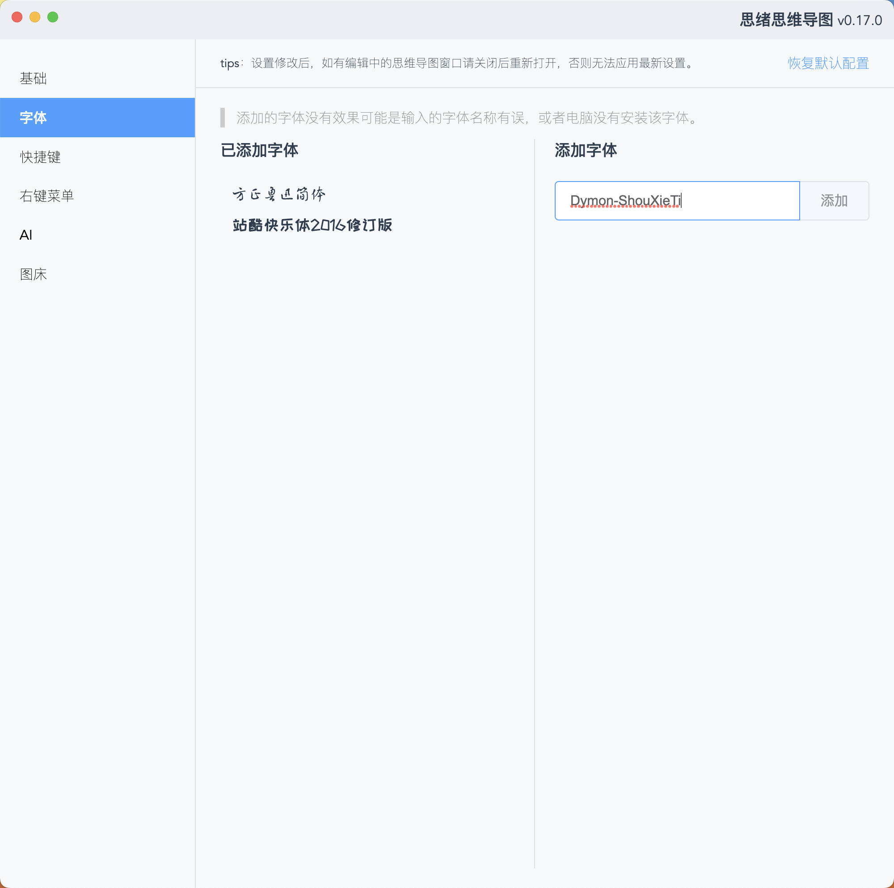
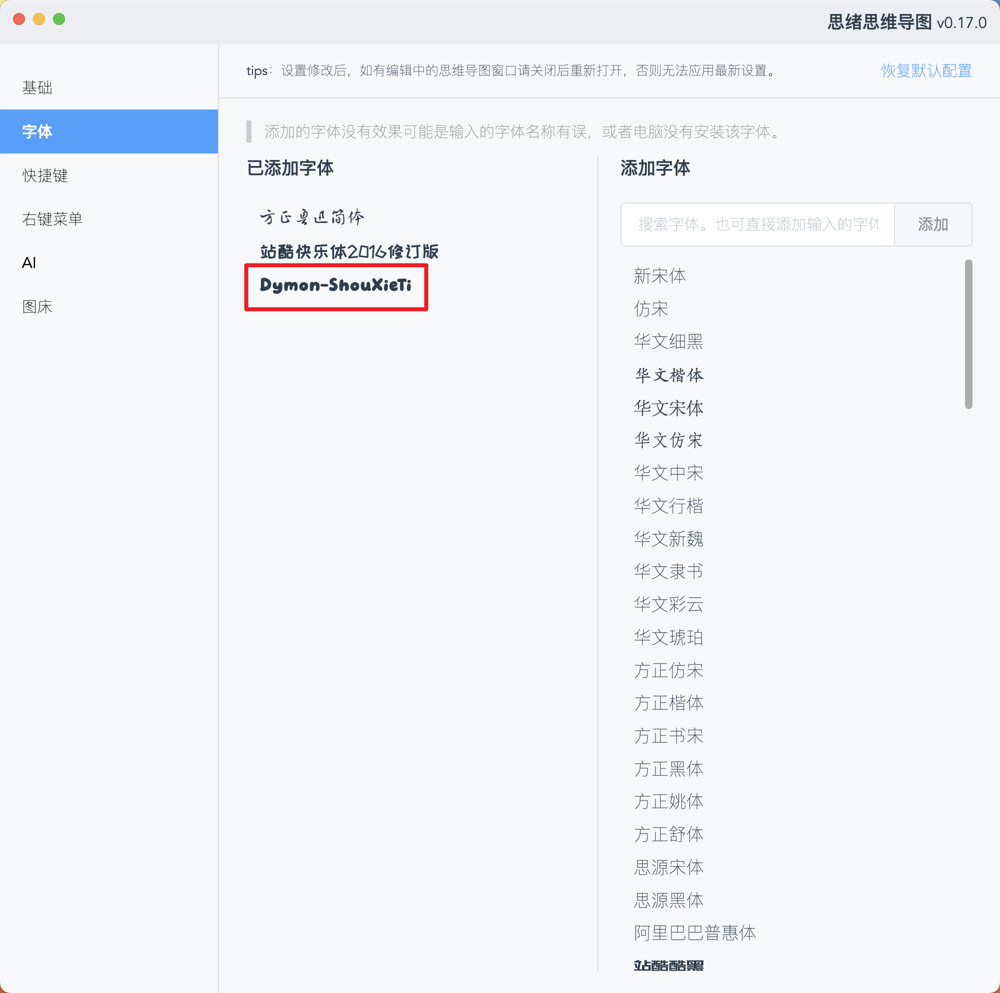
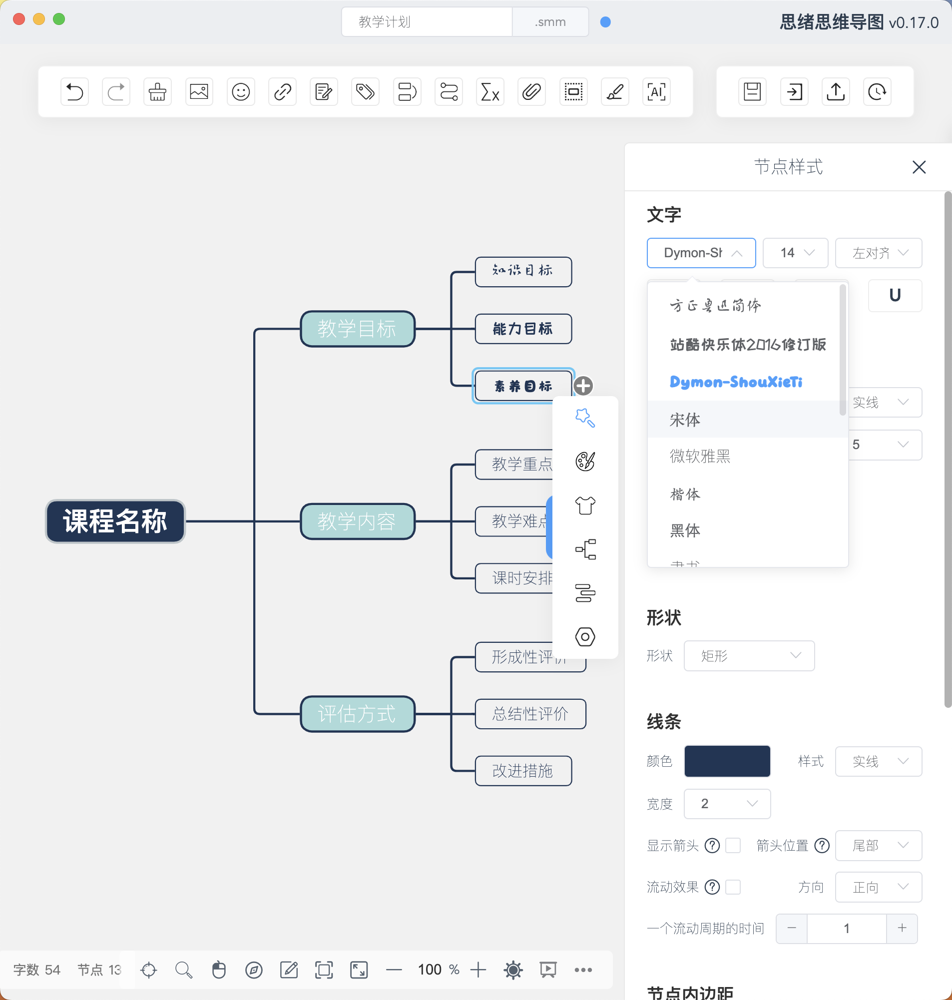
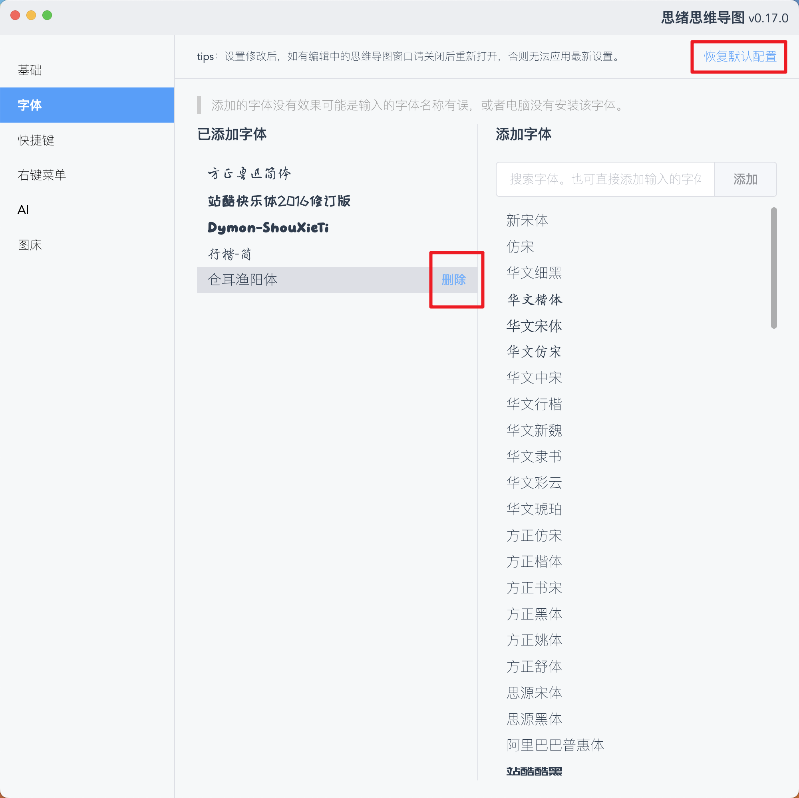

# 如何在思维导图中使用自定义字体

思绪思维导图从0.16.0版本开始支持自定义字体，也就是可以添加预设字体列表外的其他字体。

默认情况下软件只预设了一个简单的字体列表：

显然这无法满足个性化的使用需求，于是就有了自定义字体的功能。

首先需要到软件的设置里进行自定义字体管理：

注意右边这个字体列表并不是读取了你电脑中已安装的字体，最初的设想是这样的，不过经过尝试后无法做到，因为获取到的字体数量发现有几千个，显然没啥用，所以这只是我让AI生成的一个常见的字体列表供你快速选择。（如果你知道如何实现这个功能，不吝赐教）

另外如果你的电脑里已经安装了列表中的字体，那么会直接以这个字体的样式来显示这个文字，所以如果发现文字没有变化说明你电脑没有安装，可以尝试去下载和安装一下字体。

所以最简单的添加自定义字体的方法就是在这个列表中找一个能用的字体，然后点击添加，添加后会出现在左侧，这样就代表成功了，然后再打开思维导图的编辑页面，就会发现添加的字体已经存在并可以使用了：

导出为图片也是没有任何问题的：

如果某个字体这个列表没有，或者你的电脑里没有安装，那么就的确保电脑先安装，然后在的输入框中输入字体名称来添加。

可以去任何你喜欢的网站下载字体，比如：https://ziyouziti.com/

我们随便安装一个：

安装完成后可以点击查看字体的详细详细（以Mac系统为例，Windows系统需自行研究~）：

复制出字体的名称，添加到思绪思维导图中：

添加后发现成功应用字体样式后就代表成功了，然后再次打开思维导图编辑页面即可使用：

那么如果添加后发现没有文字字体没有变化，则代表这个名称不正确，这确实就有点麻烦了，只能多尝试几个名称，可以在字体信息中，或者字体下载网站的详情页中寻找对应可能的字体名称/标识符进行尝试。

如果实在不行，就换一个字体把。

当然，添加后的字体也可以删除：

如果你还有其他什么功能不明白的欢迎评论区留言~